# LCD LightTable
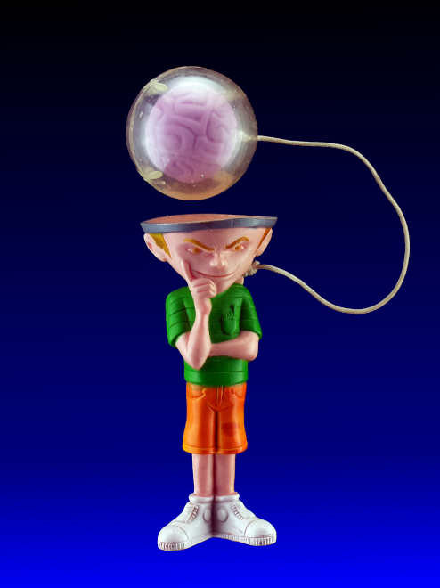

---
Table Top Photograpy with Background Removal,  using an LCD monitor as a Light Table.
Raspberry Pi HQ camera, Python, and Gimp.

---

The script captures two images:  the first with the LCD Light Table turned on, the second with the Light Table turned off.

Using just the first image, selecting and deleting the background:

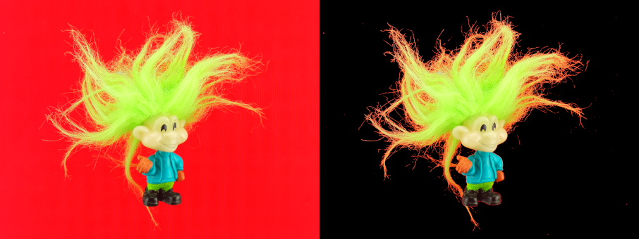

The table color reflects off the sides of the object and shines through the transparent parts, giving a red border to the object: color spill. (looks interesting though...)

Instead of deleting the background, invert the selection and delete the foreground: 

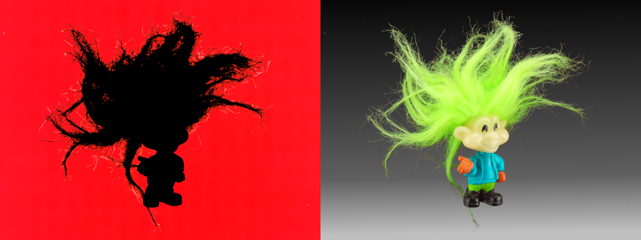

This creates a mask that can be applied to the image taken with the light table off.  The result is clean edges with no color spill.

---
## Setup
- LCD monitor mounted horizontally
- Raspberry Pi HQ camera mounted approximately 80cm above monitor
- 16mm lens
- Raspberry Pi 3
- PiTFT 320x240 display from [Adafruit](https://www.adafruit.com/product/2423)

  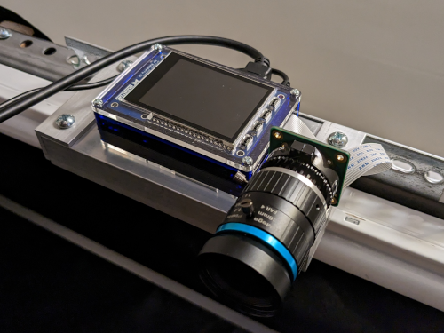
---
## Software
### Keyboard Commands:

Key | Description
:-:|:-
q | Quit program
ESCAPE | Quit program
TFT #4 | Quit program
r | Table color Red
g | Table color Green
b | Table color Blue
y | Table color Yellow
c | Table color Cyan
m | Table color Magenta
RIGHT | Table color increment
LEFT | Table color decrement
z | Enable/disable zoom
TFT #3 | Enable/disable zoom   
SPACE | Enable/disable menu
TFT #2 | Enable/disable menu
RETURN | Capture image
TFT #1 | Capture image

---

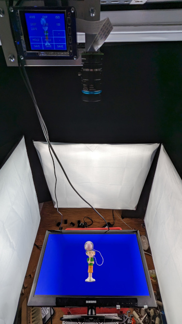

---

### TFT Display commands:
- AWB - Average White Balance
  - Red Gain
  - Blue Gain
  - **HOLD**: prevent the AWB from changing
  - **SAVE**: write current AWB values to config.ini.
- EXP - Exposure
  - Exposure time
  - **HOLD**: prevent the EXP from changing
  - **SAVE**: write current EXP value to config.ini.
- ISO - Sensitivity
  - ISO
  - **+**: increment ISO by 100.  maximum 800
  - **-**: decrement ISO by 100.  minimum 100
  - **SAVE**: write current ISO value to config.ini.

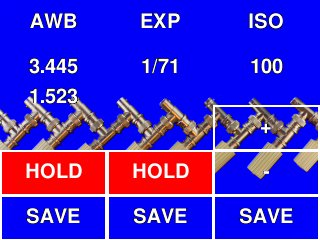

### TFT Buttons

Button | Description
-|-
#1 | Capture image
#2 | Enable/disable menu
#3 | Enable/disable zoom
#4 | Quit 

### TFT Zoom
- Press 'z' on keyboard, or TFT #3 to enter zoom mode
- Zoom magnification is determined by `config.ini` key 'magnify'. Default is 4X
- If menu is enabled, the four circles can be used to move the zoom window

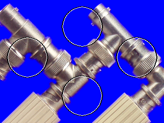

---

### Configuration File

Program settings are stored in `config.ini` located in the same directory as `lighttable.py`

&nbsp;|Configuration Settings|&nbsp;
-|-|-
**Key**|**Description**|**Default**
exposure | exposure time in usec | 10000
iso | sensitivity | 200
magnify | zoom magnification | 4
Rgain | red gain | 3.367
Bgain | blue gain | 1.539
saturation | image saturation | 20

---
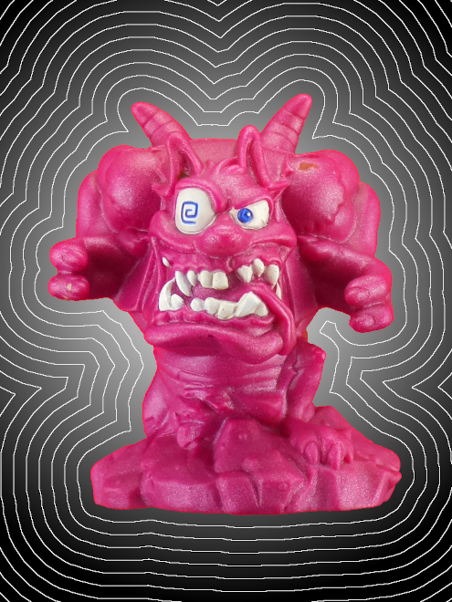

---
## Workflow

### White Balance
- Cover LCD with White Card
- Turn on final lighting
- Release HOLD on AWB
- When Red/Blue gains stop changing, set HOLD
- SAVE the AWB to `config.ini`
### Focus
- Place the focus target on the LCD. Raise the target to approximately the height of the object.
- Open camera aperature to maximum.
- Enter zoom mode (key 'z' or TFT #3)  Move the zoom window using the TFT circles.
- Adjust focus.  
- Lock focus.
  |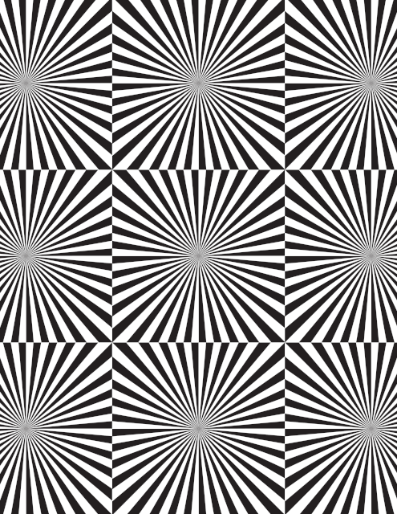|
  |:-:|
  |Focus Target|
  |(larger version here: [Focus 50% Gray](images/focus50.png))|

### Exposure

- Unfortunately, the PiCamera AutoExposure and ISO settings don't work reliably, so these settings are just approximations.  Set the final exposure by adjusting the aperature before the final capture.
- Set the aperature an f-stop or two below maximum opening (around f2.8 on the 16mm lens).  This will improve the depth of field, and allow for adjustments in the final preview.
- Place a gray card on the LCD.  The Focus Target can be used (50% gray)
- Release HOLD on EXP
- Adjust ISO to get an exposure time between 1/100 and 1/30 (approximately).
- SAVE the ISO to `config.ini`
- Set HOLD on EXP
- SAVE the EXP to `config.ini`

### Capture
- Select a color for the LCD light table that contrasts with the Object.
- Color can be selected with a key: **r,g,b,y,c,m** or by rotating the color wheel **LEFT,RIGHT**
- Make small adjustments to the aperature as desired
- Capture (key: **ENTER**)  You can also press TFT #1, but this can cause camera wobble leading to blurring...
- Two images are captured:  a mask image, taken with the light table on, and a foreground image, taken with the light table off.
### Edit
- Open the foreground image in gimp
- Open 'as Layers...' the mask image
- Select the mask layer, then **Add Alpha Channel** _( Layer | Transparency | Add Alpha Channel )_
- Select the mask layer background **By Color** _( Select | By Color )_.  Adjust Threshold as needed
- Invert the selection _( Select | Invert )_ Everything that isn't background is now selected.
- Delete the selection.  This removes the object from the mask layer and reveals the foreground object below (taken when the light table was off)
- Invert the selection _( Select | Invert )_ The mask background is again selected.
- Replace background with gradient, etc...

---
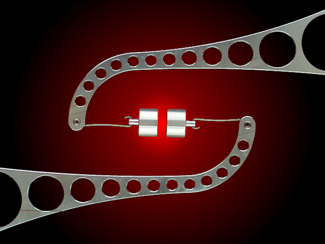
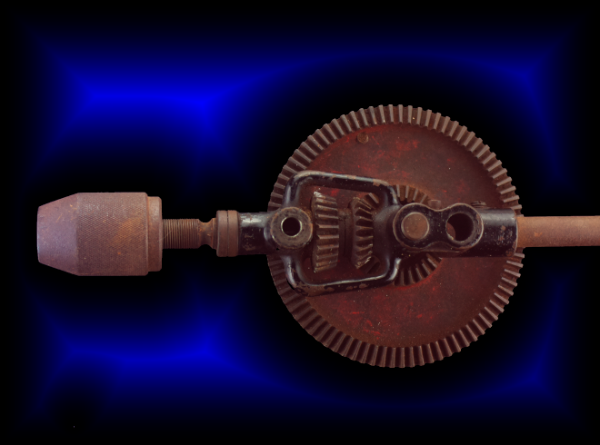
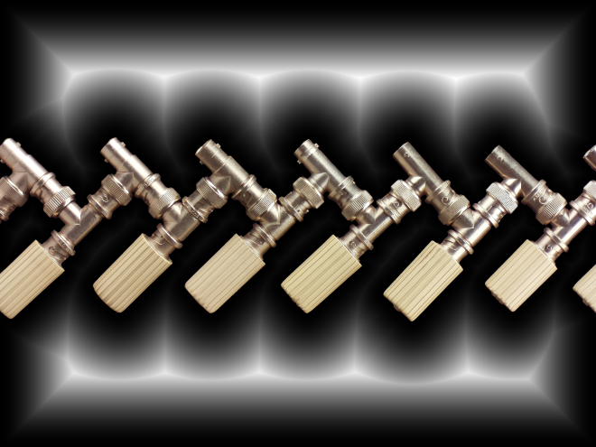
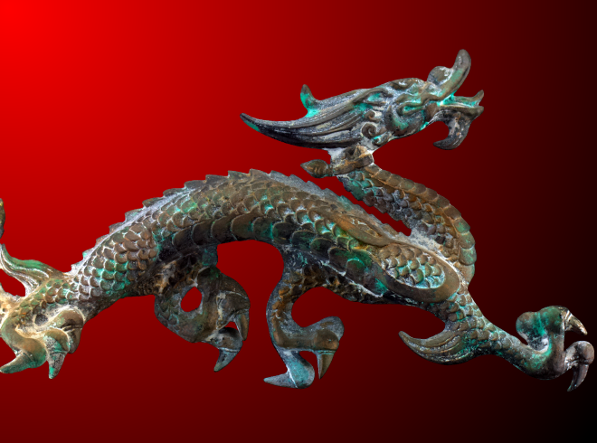

